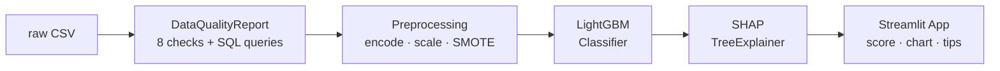

# Insurance Re-Shopping Predictor

[](https://huggingface.co/spaces/architechs/insurance-reshopping-predictor)
[](LICENSE)
[](https://www.python.org/)

Predicts whether you'd benefit from re-shopping your car insurance — using ML trained on 381K real insurance profiles. An end-to-end ML project covering data quality analysis, feature engineering, LightGBM classification, and SHAP-powered explainability. The focus is on treating data validation as the primary engineering concern, not just model accuracy.

## Data Quality First

This project treats **data quality as the primary engineering concern**, not model accuracy. The `DataQualityReport` class runs 8 categories of checks before any modeling begins — because in production insurance ML, garbage in means garbage out.

| Check | Status | Details |
|-------|--------|---------|
| Schema Validation | PASS | 12 cols, 381,109 rows |
| Missing Values | PASS | 0 missing values |
| Class Balance | WARN | 12.26% positive rate (expected) |
| Duplicate IDs | PASS | 0 duplicates |
| Range Violations | PASS | 0 violations |
| Suspicious Patterns | WARN | Premium outliers detected, sparse channels flagged |
| **Overall Quality Score** | **95/100** | Weighted composite |

Every check includes SQL-style validation queries as documentation — because data scientists who think in SQL build more trustworthy pipelines.

## Architecture



## Key Findings from EDA

- **Class imbalance**: 12.26% positive rate (interested in re-shopping) vs 87.74% not interested — addressed with SMOTE on training set only
- **Vehicle_Damage is the strongest univariate predictor**: customers with prior vehicle damage are ~3.5x more likely to be interested in re-shopping
- **Previously_Insured is nearly perfectly predictive of non-response**: 99.8% of previously insured customers show no interest — documented as potential near-leakage that warrants investigation in production
- **Age distribution**: most re-shopping interest comes from the 30–50 age range, with peak propensity around age 40–45

## Model Performance

| Metric | Train | Val | Test |
|--------|-------|-----|------|
| ROC-AUC | 0.9705 | 0.8478 | 0.8468 |
| F1 (positive class) | 0.8912 | 0.3727 | 0.3776 |
| Precision | 0.9022 | 0.3562 | 0.3568 |
| Recall | 0.8805 | 0.3909 | 0.4010 |

*Train metrics reflect SMOTE-balanced data (50/50 split). Val/Test metrics are on the original 88/12 distribution.*

## Why LightGBM

LightGBM is the industry standard for tabular insurance data. It handles class imbalance natively via `class_weight='balanced'`, trains fast on 380K+ rows, supports native categorical features, and is fully compatible with SHAP's TreeExplainer for exact Shapley value computation. Gradient-boosted trees are the go-to baseline for insurance tabular ML.

## Data Quality Decisions

1. **Drop `id` column** — row identifier, not a predictive feature. Including it would cause memorization.
2. **Binary encode Gender** — only 2 values, OHE would add a redundant column.
3. **Ordinal encode Vehicle_Age** — natural order exists (newer < older), ordinal preserves it for tree splits.
4. **Binary encode Vehicle_Damage** — Yes/No binary, same rationale as Gender.
5. **Log-transform Annual_Premium** — heavily right-skewed (max ~540K, median ~31K). Log compresses the tail and stabilizes variance.
6. **StandardScaler on continuous features** — LightGBM is scale-invariant, but scaling ensures SHAP values are on comparable scales for interpretation.
7. **SMOTE on training set only** — generates synthetic minority samples to address 88/12 imbalance. Never applied to validation or test sets (would leak information and inflate metrics).

## Limitations

- **Trained on Indian market insurance data** — feature distributions and calibration may differ in North American context. Premium ranges, region codes, and sales channels are India-specific.
- **No price data from competing insurers** — we predict re-shopping *propensity*, not actual savings amount. A customer likely to re-shop may or may not find a better price.
- **SMOTE generates synthetic minority samples** — these are interpolated, not real customer profiles. Inspect the synthetic data distribution before production use.
- **Previously_Insured near-leakage** — this feature is almost perfectly predictive, which may indicate label leakage rather than genuine signal. Production deployment should investigate this relationship.

## Quick Start

```bash
# 1. Clone and install
git clone https://github.com/Archit-Konde/insurance-reshopping-predictor.git
cd insurance-reshopping-predictor
pip install -r requirements.txt

# 2. Download dataset
# Place train.csv from Kaggle in data/raw/train.csv
# https://www.kaggle.com/datasets/anmolkumar/health-insurance-cross-sell-prediction

# 3. Run the pipeline
make all        # quality report + training

# 4. Launch the app
make app        # starts Streamlit on port 8501

# 5. Run tests
make test
```

## Live Demo

[](https://huggingface.co/spaces/architechs/insurance-reshopping-predictor)

## Project Structure

```
insurance-reshopping-predictor/
  src/
    data_quality.py      # 8-check quality report with SQL-style queries
    preprocessing.py     # encoding, scaling, SMOTE pipeline
    train.py             # LightGBM + GridSearchCV
    explain.py           # SHAP waterfall, factors, counterfactuals
  app/
    app.py               # Streamlit app (2 tabs)
    components/          # input form, results panel, quality tab
  data/
    raw/                 # place train.csv here
    processed/           # generated quality report
  models/                # saved model + pipeline + metadata
  tests/                 # pytest suite
  docs/                  # GitHub Pages landing page
  notebooks/             # EDA notebook
```

## License

MIT License. See [LICENSE](LICENSE).

---

Built by [Archit Konde](https://archit-konde.github.io/) | 2026
